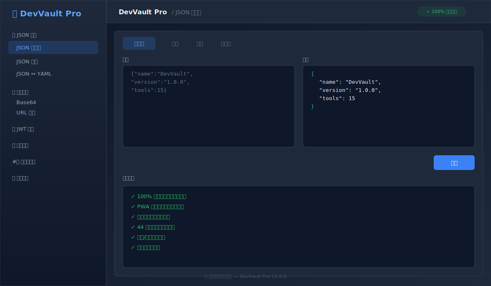
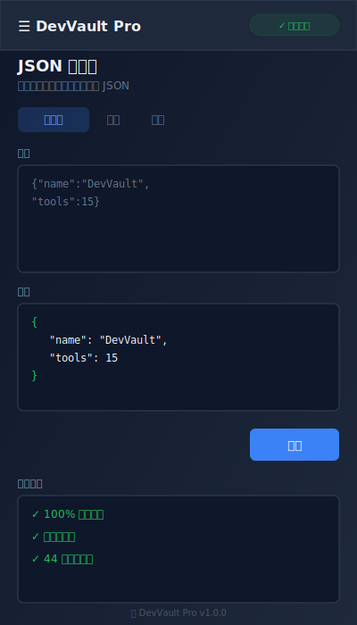

<div align="center">


# 🔒 DevVault Pro

**你的数据，永远只属于你**

[](https://github.com/dfhhvc/devvault-pro/releases)
[](LICENSE)
[](src/lib/__tests__)
[](https://www.typescriptlang.org/)
[](https://nextjs.org/)
[](https://tailwindcss.com/)

[🚀 在线体验](https://dfhhvc.github.io/devvault-pro) · [📖 功能介绍](#-功能列表) · [⚡ 快速开始](#-快速开始) · [🤝 参与贡献](#-贡献指南)

</div>

---

## 💡 为什么需要 DevVault Pro？

> 你是否也有过这样的担忧？

- 调试 JWT Token 时，把公司内网的 Token 贴到了某个「在线解析工具」...
- 格式化包含客户信息的 JSON 时，数据被某个网站默默记录...
- 测试正则表达式时，匹配的内容涉及隐私...
- 生成密码时，不信任在线生成器的随机性...

**DevVault Pro 解决的核心问题：**

| 传统在线工具 | DevVault Pro |
|-------------|-------------|
| 数据上传到第三方服务器 | ✅ **100% 浏览器本地处理** |
| 不知道工具是否在记录数据 | ✅ **开源代码，可审计** |
| 需要联网才能使用 | ✅ **断网也能用，支持 PWA 离线** |
| 功能分散在多个网站 | ✅ **15+ 工具一站式集成** |
| 广告、追踪、弹窗 | ✅ **零广告、零追踪、零埋点** |

---

## 🎯 谁在用 DevVault Pro？

- **后端开发者** — 调试 API 返回的 JSON、解析 JWT、测试正则
- **前端开发者** — 处理 Base64 图片、URL 编码、HTML 实体转换
- **DevOps 工程师** — 时间戳转换、哈希计算、生成唯一 ID
- **安全工程师** — 验证密码生成器的密码学安全性
- **隐私敏感用户** — 任何不想把数据交给第三方的人

---

## ✨ 功能列表

### 📁 JSON 工具组
开发者的日常必备：

| 工具 | 功能 | 典型场景 |
|------|------|----------|
| **JSON 格式化** | 美化 / 压缩 / 转义 / 去转义 | 调试 API 响应 |
| **JSON 验证** | 语法检查，精确到行号列号 | 排查配置文件错误 |
| **JSON ↔ YAML** | 双向转换 | Docker Compose / K8s 配置 |
| **JSON ↔ CSV** | 双向转换 | 数据报表导出 |
| **JSONPath 查询** | 用表达式提取嵌套数据 | 从复杂 JSON 中提取特定字段 |

### 🔐 编码解码组
Web 开发常用编码一网打尽：

| 工具 | 功能 | 典型场景 |
|------|------|----------|
| **Base64** | 支持 UTF-8（含中文、Emoji） | 图片转 Base64 嵌入 CSS |
| **URL 编码** | encodeURIComponent | 构造查询参数 |
| **HTML 实体** | 纯 JS 实现，无 XSS 风险 | 安全显示用户输入 |
| **Hex 编码** | 十六进制与文本互转 | 二进制数据调试 |

### 🎫 JWT 调试
**⚠️ 安全设计**：仅解码显示，**明确标注不验证签名**（需要发行方密钥）

- 解析 Header、Payload、Signature
- 自动检测过期状态
- 人可读的时间格式化

### 🎯 正则测试
- 实时匹配、捕获组高亮
- 内置 8 种常用正则示例：邮箱、手机号、URL、IP、身份证号、UUID、日期、密码强度

### #️⃣ 哈希与生成
密码学安全的随机生成：

| 工具 | 算法 | 用途 |
|------|------|------|
| **哈希计算** | MD5 / SHA-1 / SHA-256 / SHA-512 | 数据完整性校验 |
| **UUID** | v1 / v4 | 唯一标识符 |
| **NanoID** | 可配置长度 | 短唯一 ID |
| **ULID** | 字典序唯一 | 数据库主键 |
| **密码生成** | `crypto.getRandomValues` | 高强度随机密码 |

### ⏰ 时间工具
- Unix 时间戳 ↔ 人类可读日期
- 10 个常用时区实时对照（UTC、北京时间、东京、纽约、伦敦等）

---

## 🛡️ 安全承诺

**DevVault Pro 的安全不是口号，是可验证的事实：**

| 承诺 | 状态 | 如何验证 |
|------|------|----------|
| 100% 前端实现 | ✅ | 按 `F12` → Network 面板，使用任意工具，确认**无任何请求发送** |
| 零数据上传 | ✅ | 断网也能正常使用 |
| 无后端 API | ✅ | 纯静态站点，没有 `/api/*` 端点 |
| 无追踪分析 | ✅ | 无 Google Analytics、无百度统计 |
| 可完全离线 | ✅ | PWA + Service Worker，安装后断网可用 |
| 内存中处理 | ✅ | 不存储用户输入到 localStorage / IndexedDB |
| 密码学安全 | ✅ | 使用浏览器原生 `crypto.getRandomValues`，非 `Math.random()` |
| XSS 防护 | ✅ | 纯 JS 实现 HTML 实体编解码，不使用 `innerHTML` |

### 🔍 动手验证（30 秒）

1. 打开 [在线演示](https://dfhhvc.github.io/devvault-pro)
2. 按 `F12` 打开开发者工具 → **Network** 面板
3. 清除已有记录（点击 🚫 图标）
4. 在任意工具中粘贴敏感数据并处理
5. 观察 Network 面板：**没有任何请求发送你的数据**

---

## 🚀 快速开始

### 方式一：在线使用（推荐）

直接访问：**[https://dfhhvc.github.io/devvault-pro](https://dfhhvc.github.io/devvault-pro)**

无需安装，即开即用。

### 方式二：PWA 安装（离线使用）

1. 用 Chrome/Edge 打开在线演示
2. 地址栏右侧点击 **「安装」** 图标（或菜单 → 安装 DevVault Pro）
3. 安装后可在桌面/开始菜单启动，**完全离线可用**

### 方式三：本地开发

```bash
# 克隆仓库
git clone https://github.com/dfhhvc/devvault-pro.git
cd devvault-pro

# 安装依赖（需要 pnpm）
pnpm install

# 启动开发服务器
pnpm dev

# 打开 http://localhost:3000
```

### 方式四：Docker 部署

```bash
# 构建镜像
docker build -t devvault-pro .

# 运行容器
docker run -p 3000:3000 devvault-pro
```

---

## 🧪 测试覆盖

```bash
# 运行所有测试
pnpm test

# 运行测试并显示 UI
pnpm test:ui

# 生成覆盖率报告
pnpm test:coverage
```

**当前测试状态：**
- ✅ **44 个测试用例全部通过**
- ✅ 加密/编码算法验证
- ✅ JSON/YAML/CSV 转换验证
- ✅ HTML 实体编解码安全验证
- ✅ 密码生成器密码学安全性验证

---

## 🏗️ 技术栈

- **[Next.js 16](https://nextjs.org/)** — React 全栈框架
- **[React 19](https://react.dev/)** — UI 库
- **[TypeScript 5.5](https://www.typescriptlang.org/)** — 类型安全
- **[Tailwind CSS 4](https://tailwindcss.com/)** — 原子化 CSS
- **[shadcn/ui](https://ui.shadcn.com/)** — 无障碍 UI 组件
- **[Vitest](https://vitest.dev/)** — 单元测试框架
- **[Lucide](https://lucide.dev/)** — 图标库

---

## 📸 界面预览

<div align="center">

| 桌面端 | 移动端 |
|--------|--------|
|  |  |

</div>

> 实际界面请访问 [在线演示](https://dfhhvc.github.io/devvault-pro) 体验。

---

## 🛠️ DevVault Pro vs 原版 DevVault

| 特性 | DevVault (原版) | DevVault Pro |
|------|----------------|--------------|
| Service Worker 缓存 | ⚠️ 不完整 | ✅ Stale-While-Revalidate 策略 |
| JWT 安全提示 | ⚠️ 易误解 | ✅ 明确标注「仅解码，不验证签名」|
| 正则高亮 | ⚠️ 捕获组位置错误 | ✅ 精确位置索引高亮 |
| 密码生成 | ⚠️ 有统计偏置 | ✅ Rejection Sampling 无偏置 |
| HTML 实体解码 | ⚠️ 使用 `innerHTML` | ✅ 纯 JS 实现，无 XSS |
| TypeScript 版本 | ⚠️ 5.0.2 | ✅ 5.5+ |
| 单元测试 | ❌ 无 | ✅ 44 个测试 |
| Docker 支持 | ❌ 无 | ✅ 已配置 |
| GitHub Actions CI/CD | ❌ 无 | ✅ 自动构建部署 |

---

## ⌨️ 快捷键

| 快捷键 | 功能 |
|--------|------|
| `Ctrl + K` | 切换侧边栏 |
| `Ctrl + D` | 清空当前输入 |
| `Ctrl + Enter` | 执行处理 |
| `Ctrl + Shift + L` | 切换深色/浅色模式 |
| `Ctrl + /` | 显示快捷键帮助 |

---

## 🤝 贡献指南

欢迎提交 Issue 和 Pull Request！

### 提交规范

使用 [Conventional Commits](https://www.conventionalcommits.org/)：

```
feat: 添加新工具
fix: 修复正则高亮 Bug
docs: 更新 README
test: 添加测试用例
```

### 开发流程

1. Fork 本仓库
2. 创建分支：`git checkout -b feat/your-feature`
3. 提交更改：`git commit -m 'feat: add something'`
4. 推送分支：`git push origin feat/your-feature`
5. 打开 Pull Request

详见 [CONTRIBUTING.md](CONTRIBUTING.md)

---

## 📄 许可证

[MIT](LICENSE) © 2024 DevVault Pro Contributors

---

<div align="center">

**🔒 你的数据，你做主。**

[⭐ Star 这个项目](https://github.com/dfhhvc/devvault-pro) · [🐛 提交 Issue](https://github.com/dfhhvc/devvault-pro/issues) · [💡 提出建议](https://github.com/dfhhvc/devvault-pro/discussions)

</div>
